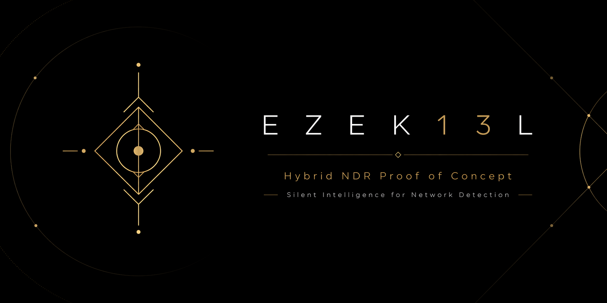
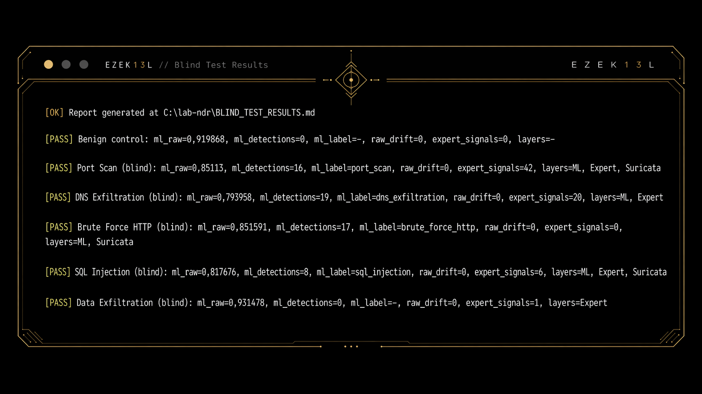
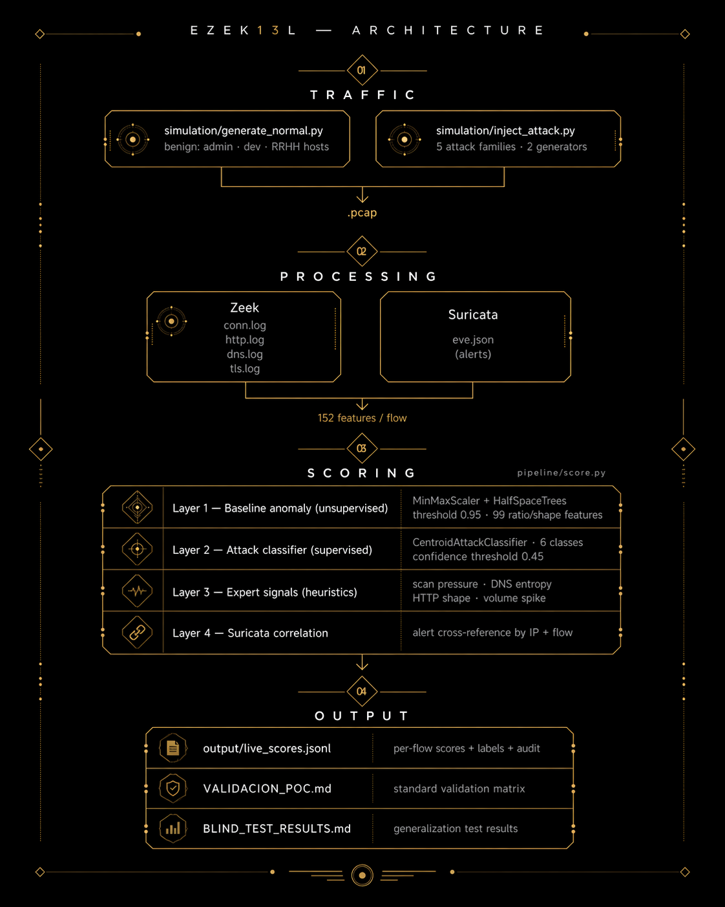

Tu README está muy bien planteado. No necesita más contenido: necesita presentación visual. Yo haría estos cambios:

Crear una cabecera tipo landing page.
Cambiar los textos [IMAGE: ...] por imágenes reales en assets/.
Añadir badges.
Hacer el resumen inicial más visual.
Poner partes largas en <details>.
Añadir una sección de resultados rápida arriba.

Te dejo una versión mejorada del inicio, lista para pegar.

<div align="center">



# EZEK13L

### Network Detection & Response — Local Lab

<p>
  <strong>Multi-layer NDR proof-of-concept using Zeek, Suricata, River ML and behavioural heuristics.</strong>
</p>

<p>
  
  
  
  
  
</p>

<p>
  <a href="#the-idea">The idea</a> ·
  <a href="#quick-results">Results</a> ·
  <a href="#installation">Installation</a> ·
  <a href="#architecture">Architecture</a> ·
  <a href="#blind-generalization-test">Blind test</a> ·
  <a href="#limitations">Limitations</a>
</p>

</div>

---

> A proof-of-concept. Synthetic traffic, virtual hosts, no production claims.  
> What it demonstrates: a multi-layer detection architecture that reads behaviour, not just signatures.

---

## Quick results

| Scenario | Result | Detection layers |
|---|---:|---|
| Benign control | PASS | — |
| Port Scan | PASS | ML · Expert · Suricata |
| DNS Exfiltration | PASS | ML · Expert |
| Brute Force HTTP | PASS | ML · Suricata |
| SQL Injection | PASS | ML · Expert · Suricata |
| Data Exfiltration | PASS | Expert |

<div align="center">



<br>

<strong>Blind result: 5/5 attacks detected</strong>

</div>

---

## The idea

Most IDS demos stop at Suricata firing on a known payload. **EZEK13L goes one layer deeper.**

It combines:

| Layer | Purpose |
|---|---|
| **Suricata** | Signature-based detection |
| **HalfSpaceTrees** | Unsupervised anomaly scoring |
| **Centroid classifier** | Supervised attack classification |
| **Expert heuristics** | Behavioural detection signals |

When one layer misses, another can still catch the behaviour.


Luego puedes conservar casi todo tu README actual debajo.

Cambios concretos que haría
1. Sustituye los placeholders [IMAGE: ...]

Crea esta carpeta:

assets/
├── ezek13l-banner.png
├── blind-test-terminal.png
├── topology.png
├── validation-vs-blind.png
└── architecture.png

Y cambia esto:

[IMAGE: dark terminal screenshot showing the blind test output...]

Por esto:

<div align="center">
  
</div>
2. Haz que la arquitectura sea imagen, no solo ASCII

Tu diagrama ASCII está bien para documentación técnica, pero visualmente una imagen queda mucho mejor.

Puedes dejar ambas cosas:

## Architecture

<div align="center">
  
</div>

<details>
<summary>Text version</summary>

```txt
TU DIAGRAMA ASCII AQUÍ
</details> ```

Esto mantiene el README bonito sin perder detalle técnico.

3. Usa <details> para secciones largas

Por ejemplo, la estructura del repositorio ocupa mucho espacio. Mejor así:

## Repository structure

<details>
<summary>View repository tree</summary>

```txt
lab-ndr/
├── simulation/
├── pipeline/
├── scripts/
├── model/
├── suricata/etc/
├── VALIDACION_POC.md
└── BLIND_TEST_RESULTS.md
</details> ```

También lo usaría para:

<details>
<summary>Full validation output</summary>

```txt
[PASS] Control benigno ...
</details> ```
4. Convierte “What comes next” en roadmap visual
## Roadmap

- [ ] Evaluate against CICIDS2017 or UNSW-NB15
- [ ] Expand data exfiltration training set
- [ ] Add adversarial generator variants
- [ ] Build layer attribution report
- [ ] Add dashboard view for live scores

Queda más GitHub-native y más profesional.

5. Cambia el cierre por algo más fuerte

Tu final actual es bueno:

It is a lab. A well-built one.

Yo lo dejaría, pero lo pondría más visual:

---

## Summary

EZEK13L detects what it was built to detect — and the blind test shows it learned behaviour, not parameters.

The data exfiltration gap is real, documented, and covered by heuristics.

> It is a lab.  
> A well-built one.

---

<div align="center">

**Suricata · Zeek · River · Scapy · Docker**

</div>